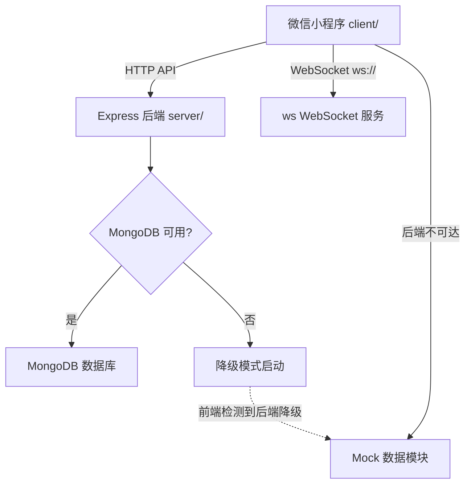

## 产品概述

修复并跑通"旅行搭子"微信小程序项目的前后端，使项目在 Mock 降级模式下能完整运行和预览。

## 核心功能

- 补全后端缺失的"加入行程"API（`POST /api/trips/:id/join`），确保前后端所有 API 对应完整
- 修复项目配置问题：统一 AppID、设置有效的 JWT_SECRET
- 修正文档和注释中 Socket.io 与 ws 库的不一致描述
- 重启后端服务并验证所有 API 端点正常
- 通过微信开发者工具 CLI 导入 client 目录，确保前端小程序能在模拟器中正常加载和展示
- 验证前后端联通：健康检查通过，Mock 降级模式下 UI 完整可用

## 技术栈

- 前端：微信小程序原生开发（WXML + WXSS + JS）
- 后端：Node.js + Express.js + MongoDB（Mongoose）+ ws（WebSocket）
- 当前运行模式：MongoDB 未安装，后端以降级模式运行，前端自动切换 Mock 数据

## 实现方案

### 1. 补全 `POST /api/trips/:id/join` 后端路由

**问题本质**：前端 `detail.js` 第 71 行调用 `post('/trips/${id}/join')`，但后端 `routes/trip.js` 和 `controllers/tripController.js` 中没有对应路由和方法。Mock 模式下不受影响（mock.js 第 227-232 行已覆盖），但连接真实后端时会 404。

**实现策略**：

- 在 `server/controllers/tripController.js` 中新增 `join` 方法。由于 Trip 模型没有 `members` 字段（当前只有 `maxMembers`），join 逻辑应简单返回成功，保持与 Mock 数据一致的响应格式 `{ code: 0, data: { joined: true }, message: '加入成功' }`。后续如需完整的成员管理可扩展 Trip 模型。
- 在 `server/routes/trip.js` 中新增 `router.post('/:id/join', auth, tripController.join)`，放在 `router.get('/:id')` 之前以避免路由匹配冲突。

### 2. 修复配置问题

- **JWT_SECRET**：将 `server/.env` 中的占位值替换为一个有效的随机字符串，确保本地开发时 token 签发正常
- **根目录 project.config.json**：微信开发者工具应以 `client/` 为项目目录打开（该目录 `urlCheck: false` 允许 localhost），无需修改根目录配置

### 3. 修正文档/注释不一致

- `server/app.js` 第 44 行注释 `// ====== Socket.io ======` 改为 `// ====== WebSocket ======`
- `README.md` 第 21 行 `Socket.io（实时通信）` 改为 `ws（原生 WebSocket，实时通信）`

### 4. 重启后端并验证

- 终止当前后端进程，重新启动
- 逐一验证关键 API：`/api/health`、`/api/trips/hot`（需 auth，预期 401）、确认 join 路由注册（预期 401 而非 404）

### 5. 微信开发者工具导入项目

- 使用 CLI 命令 `/Applications/wechatwebdevtools.app/Contents/MacOS/cli open --project /Users/hanyufei/Documents/Git/travel-buddy/client` 导入项目
- 如果 CLI 失败，指导用户手动操作

## 实现备注

- **路由顺序**：`/:id/join` 必须在 `/:id` 之前注册，否则 Express 会将 `join` 匹配为 `:id` 参数
- **向后兼容**：join 方法先做简单实现（返回成功），不修改 Trip 模型的 Schema，避免影响现有数据结构
- **降级模式验证**：由于无 MongoDB，真实 API 调用会失败并触发前端自动降级到 Mock，这是设计预期行为

## 架构设计



## 目录结构

```
server/
├── routes/
│   └── trip.js              # [MODIFY] 新增 POST /:id/join 路由
├── controllers/
│   └── tripController.js    # [MODIFY] 新增 join 方法
├── app.js                   # [MODIFY] 修正 Socket.io 注释为 WebSocket
├── .env                     # [MODIFY] 设置有效的 JWT_SECRET
README.md                    # [MODIFY] 修正 Socket.io 描述为 ws
```

## Agent Extensions

### Skill

- **using-superpowers**
- 目的：在开始执行前加载项目开发规则
- 预期结果：确保遵循用户自定义的开发规则（TDD、版本号等）

- **verification-before-completion**
- 目的：在声称跑通之前，验证后端 API 响应和前端加载状态
- 预期结果：所有 API 端点返回预期状态码，微信开发者工具成功加载项目

### SubAgent

- **code-explorer**
- 目的：如需进一步检查代码依赖关系
- 预期结果：确认修改不引入新问题