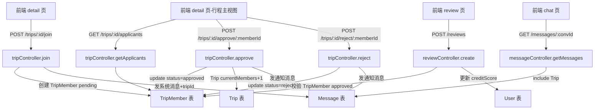

## 用户需求

### Product Overview

完善"旅行搭子"微信小程序的同行申请闭环流程，新增多人参与机制、申请审批流、行程评分和消息卡片跳转四大核心功能，参考陌陌、携程旅行伙伴、Soul等同类社交产品的交互设计。

### Core Features

1. **申请消息带行程卡片跳转**

- 聊天页系统消息（type=system）展示专属卡片样式，包含行程目的地/日期/发布者信息
- 卡片可点击，跳转到对应行程详情页
- 需在 Message 表新增 tripId 字段关联行程

2. **同意/拒绝申请审批流**

- 新增 TripMember 表记录申请关系（tripId, userId, status: pending/approved/rejected）
- 行程发布者在行程详情页可查看待审批申请列表，一键同意或拒绝
- 审批结果自动发送系统消息通知申请人
- 同意后 Trip.currentMembers +1，达到 maxMembers 时自动关闭申请入口

3. **多人加入同一行程**

- Trip 表新增 currentMembers 字段，实时追踪当前人数
- 行程详情显示"已有 X/Y 人"，满员时申请按钮变灰不可点
- 重复申请防护（已 pending/approved 时不允许再次申请）

4. **行程完成后互评**

- 行程标记完成后，行程详情底部出现"去评价搭子"入口（对行程发布者/所有已批准成员可见）
- 新建 pages/review 评价页：5星评分 + 文字评价（最多200字）
- 评价提交后更新被评用户的 creditScore 和 reviewCount
- 个人主页展示收到的评价列表

## Tech Stack

- **前端**：微信小程序（原生），复用现有 pages 结构和 utils/request.js 工具
- **后端**：Node.js + Express + Sequelize（MySQL），复用现有 controller/routes/models 结构
- **数据库**：MySQL，通过 sequelize.sync({ alter: true }) 自动同步表结构变更

## Implementation Approach

### 核心思路

以"TripMember 中间表"为核心数据纽带，串联申请、审批、人数统计、评价资格校验四个场景。Message 表增加 tripId 字段实现消息到行程的跳转关联。前端聊天页对 type=system 消息做特殊卡片渲染，详情页增加申请列表和评价入口。

### 关键技术决策

1. **TripMember 表 vs 在 Trip 中存 JSON 数组**：选择独立表，支持分页查询、状态过滤、关联查询，避免并发更新 JSON 数组的竞态问题

2. **currentMembers 字段维护**：在 approve/reject 时用 Sequelize transaction + increment/decrement 保证原子性，避免脏读

3. **消息卡片数据传递**：Message.tripId 关联 Trip，getMessages 接口 include Trip 基本信息（destination, startDate, endDate），前端按 type 分支渲染

4. **评价资格校验**：只有 TripMember.status=approved 的用户（及行程发布者）在 trip.status=completed 后才可评价，后端校验防止越权

5. **重复申请防护**：join 接口查 TripMember 是否已有 pending/approved 记录，有则拒绝

## Architecture Design



## Directory Structure

```
server/
├── models/
│   ├── Trip.js              # [MODIFY] 新增 currentMembers INTEGER 字段
│   ├── Message.js           # [MODIFY] 新增 tripId INTEGER 可空字段
│   └── TripMember.js        # [NEW] 申请成员表：tripId, userId, status(pending/approved/rejected)
├── controllers/
│   ├── tripController.js    # [MODIFY] join 方法改写+新增 getApplicants/approve/reject/getMembers 方法
│   └── reviewController.js  # [MODIFY] create 方法增加 TripMember 资格校验
├── routes/
│   └── trip.js              # [MODIFY] 新增 GET /:id/applicants, POST /:id/approve/:memberId, POST /:id/reject/:memberId, GET /:id/members
├── app.js                   # [MODIFY] 新增 TripMember 关联配置
└── test-full.js             # [MODIFY] 新增申请审批流/多人/评价资格测试用例

client/pages/
├── detail/
│   ├── detail.js            # [MODIFY] 新增 loadApplicants/approveApplicant/rejectApplicant/loadMembers，行程完成后显示评价入口，满员禁用申请按钮
│   └── detail.wxml          # [MODIFY] 新增申请人列表区块（行程主视图），成员列表，评价入口按钮，满员状态展示
├── chat/
│   ├── chat.js              # [MODIFY] 消息渲染增加 tripId 字段，系统消息点击跳转到行程详情
│   └── chat.wxml            # [MODIFY] 对 type=system 消息渲染行程卡片样式（目的地/日期/按钮）
└── review/                  # [NEW] 全新评价页
    ├── review.js            # [NEW] 5星评分交互+文字输入+提交逻辑，onLoad 接收 toUserId/tripId/nickname 参数
    ├── review.wxml          # [NEW] 星级选择器+textarea+提交按钮
    ├── review.wxss          # [NEW] 评价页样式
    └── review.json          # [NEW] 页面配置

client/app.json              # [MODIFY] 新增 pages/review/review 路由
```

## Key Code Structures

```js
// TripMember Model 核心结构
TripMember = {
  id: INTEGER PK,
  tripId: INTEGER FK(trips.id),
  userId: INTEGER FK(users.id),
  status: ENUM('pending', 'approved', 'rejected'), default: 'pending',
  // timestamps: createdAt, updatedAt
}

// 扩展后的 tripController 方法签名
exports.join(req, res)           // 防重复申请，创建 TripMember，发带 tripId 的系统消息
exports.getApplicants(req, res)  // GET /:id/applicants，仅行程主可查，返回 pending 列表
exports.approve(req, res)        // POST /:id/approve/:memberId，事务：status=approved + currentMembers++
exports.reject(req, res)         // POST /:id/reject/:memberId，status=rejected，发通知消息
exports.getMembers(req, res)     // GET /:id/members，返回 approved 成员列表

// reviewController.create 增加资格校验
const isMember = await TripMember.findOne({ where: { tripId, userId: req.userId, status: 'approved' } })
const isOwner = trip.userId === req.userId
if (!isMember && !isOwner) return fail(res, '您未参与该行程，无法评价', 403)
if (trip.status !== 'completed') return fail(res, '行程未完成，暂不开放评价', 400)
```

## Implementation Notes

1. **数据库同步**：Trip/Message/TripMember 表结构变更通过 sequelize.sync({ alter: true }) 自动执行，无需手写迁移脚本，但需注意 alter 模式在生产环境的风险（本项目云托管重启时自动同步，可接受）

2. **并发安全**：approve 接口用 Sequelize transaction，先 lock TripMember 行再 increment currentMembers，防止同一申请被多次批准

3. **满员检测**：join 接口校验 trip.maxMembers > 0 && trip.currentMembers >= trip.maxMembers 时返回"行程已满员"错误

4. **消息关联 Trip**：getMessages 接口 include Trip 时只取 id/destination/startDate/endDate 四个字段，避免数据冗余

5. **前端系统消息渲染**：chat.wxml 用 wx:if="{{item.type === 'system' && item.tripId}}" 渲染卡片，其余 system 消息（如通知文字）用居中灰色小字渲染

6. **评价页导航**：从 detail 页点击"去评价搭子"后进入评价页，URL 参数传 toUserId/tripId/toNickname，评价成功后自动返回

7. **版本号更新**：开发完成后版本号升为 v1.0.28

## Agent Extensions

### Skill

- **test-driven-development**
- Purpose: 在实现 TripMember 相关接口、评价资格校验前先编写测试用例，确保申请/审批/评价流程的正确性
- Expected outcome: server/test-full.js 中新增申请防重复、审批同意/拒绝、currentMembers 变更、评价资格校验等测试用例，全部通过后再提交

- **verification-before-completion**
- Purpose: 所有代码开发完成后，自动运行完整测试套件验证 40+ 测试用例全部通过，确认版本号已更新到 v1.0.28
- Expected outcome: 测试输出显示全部用例 PASS，服务正常启动，无 console.error 异常

- **requesting-code-review**
- Purpose: 功能实现完成后对 TripMember 模型、tripController 新增方法、reviewController 校验逻辑进行代码审查
- Expected outcome: 审查报告确认无 N+1 查询、无事务泄漏、无越权漏洞，可安全提交

### SubAgent

- **code-explorer**
- Purpose: 执行前深度探索 server/routes/trip.js 路由定义和 client/pages/messages/ 消息列表页，确认路由注册方式和消息页展示逻辑，避免遗漏修改点
- Expected outcome: 确认路由文件结构、messages 页是否需要同步更新系统消息展示